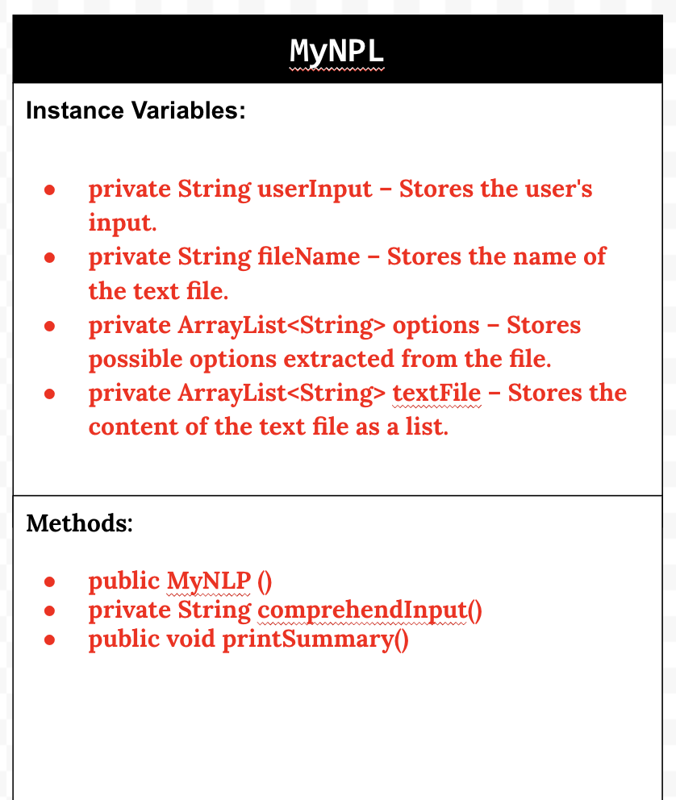
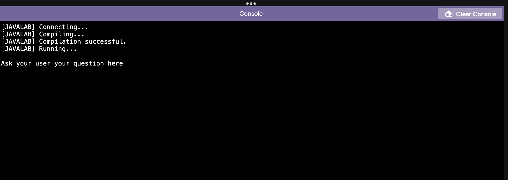
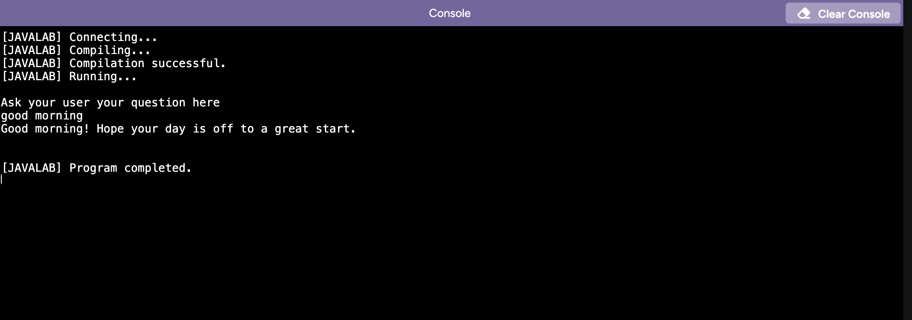
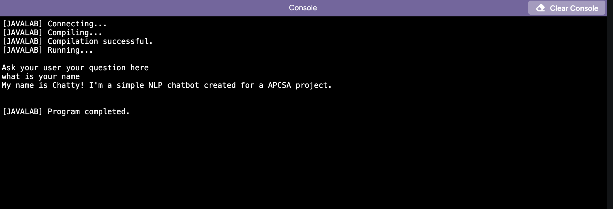
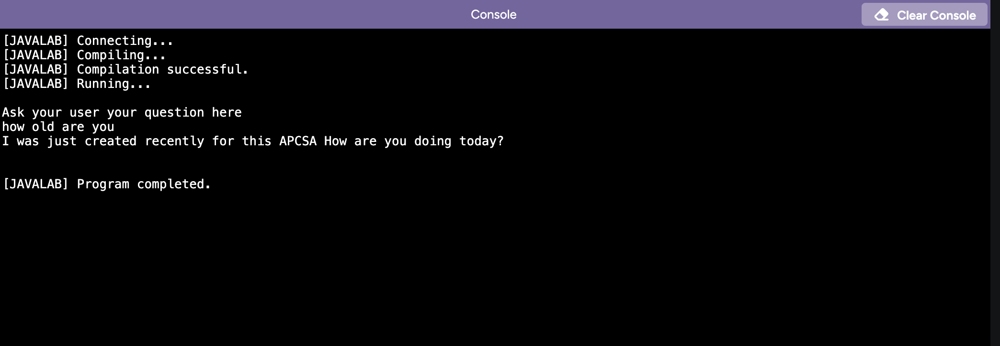

# Unit 6 - Natural Language Processing Project

## Introduction

Natural language processing (NLP) is used in many apps and devices to interact with users and make meaning of text to determine how to respond, find information, or to create new text. Your goal is to use natural language processing techniques to identify structure, patterns, and meaning in a text to have conversations with a user, execute commands, perform manipulations on the text, or generate new text.

## Requirements

Use your knowledge of object-oriented programming, ArrayLists, the String class, and algorithms to create a program that uses natural language processing techniques:

- **Create at least two ArrayLists** – Create at least two ArrayLists to store the data used in your program, such as data from text files or entered by the user.
- **Implement one or more algorithms** – Implement one or more algorithms that use loops and conditionals to find or manipulate elements in an ArrayList or String object.
- **Use methods in the String classs** - Use one or more methods in the String class in your program, such as to divide text into sentences or phrases.
- **Use at least one natural language processing technique** – Use a natural language processing technique to process, analyze, and/or generate text.
- **Document your code** – Use comments to explain the purpose of the methods and code segments and note any preconditions and postconditions.

## UML Diagram

## Video

 

## Project Description

Our goal of this project is to create a ChatBot.  This ChatBot would respond according to the response of the user’s input. We hope that the ChatBot would provide helpful information and options for the user to choose and be informed from. 

## NLP Techniques

In our code, we used tokenization in the Text Processor Java on lines 48-66, which helped us break down sentences into words so that the ChatBot would process the information easier. We used the textToWords() method to read each line and separate words by finding spaces. For example, if the sentence is "Hello world!", our method splits it into "Hello" and "world!" as separate words. This is important because computers process words one at a time, and not in whole sentences. Tokenization is used here for our chatbot to make working with text easier and more efficient.
